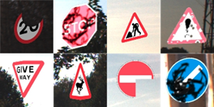

# Synthetic Dataset Generation for Traffic Sign Damage Detection
We have modified [code](https://github.com/alexandrosstergiou/Traffic-Sign-Recognition-basd-on-Synthesised-Training-Data) by Alexandros Stergiou ([2018 paper](https://www.mdpi.com/2504-2289/2/3/19)) to create synthetic traffic signs placed over background images to create a holistic dataset for training detection models. Furthermore, we have implemented various kinds of synthetic damage that are applied to the signs. This damage is quantified by using the percentage of the sign that has been changed or obscured. The purpose of this is to train a detection model to not only detect each class of sign, but to also detect the class and assess the severity of damage that is present on the sign, if any.
 
 
 
The above shows close-up examples of damage applied to synthetic signs.

## Citations
### Honours Thesis
This work formed the basis of the primary author's thesis: [Traffic Sign Damage Assessment with Synthetic Datasets](https://drive.google.com/file/d/1ga3G7J4nosSUuaum6RhyoEhmde9-34tc/view). \
This codebase's functionality is described in Chapter 3. \
It also includes 9 example images generated by this code in its Appendix.

### DICTA 2022 (outdated)
Conference paper repository (only includes an outdated portion of this repository): [End-to-End Traffic Sign Damage Assessment](https://github.com/dsphamgithub/tsda/tree/main)
```
@inproceedings{rados2022end,
  title={End-to-End Traffic Sign Damage Assessment},
  author={Radoš, Kristian and Downes, Jack and Pham, Duc-Son and Krishna, Aneesh},
  booktitle={2022 International Conference on Digital Image Computing: Techniques and Applications (DICTA)},
  year={2022},
  doi={10.1109/DICTA56598.2022.10034587}
}
```
<!-- - [ ] TODO: Add synthetic dataset paper bibtex citation once available
```
``` -->

## Installation
- [ ] TODO: Fix incorrect `environment.yaml` and bad `requirements.txt` (and/or just make a Dockerfile)

Using an Anaconda environment is recommended. Install Miniconda (terminal only) [here](https://docs.conda.io/en/latest/miniconda.html). Once installed, run the following command while in the repo directory:
```sh
$ conda env create -f environment.yaml
```

*Alternatively*, to install the required packages using pip, simply execute the following command (`pip3` may be exchanged with `pip`):
```sh
$ pip3 install -r requirements.txt
```

[comment]: <> (Note that the synthetic dataset SGTSD will need aprox. 10GB and the sample set used for training will be close to 1GB.)


## Usage
Navigate to the `signbreaker` directory. To run the generator, simply execute the following command:
```sh
$ python create_dataset.py
```
The `--output_dir` argument can be used to specify a custom directory for the generated dataset. A complete path is required.

The generator can be configured by modifying the [`config.yaml`](signbreaker/config.yaml) file.

Please allow for sufficient storage space when running the dataset generator. With default config values the size of the dataset could be on the order of 1-100 GB depending on the inputs.

### Example Downloads
**Example traffic sign templates** for data generation can be downloaded below. Place these templates into the `signbreaker/Sign_Templates/1_Input` directory. Templates can be quickly sourced using [`wikipedia_sign_templates.py`](wikipedia_sign_templates.py) ([example pages](https://kristian-rados.notion.site/Notable-Wikipedia-Wikimedia-Traffic-Sign-Pages-083306914aea41698a690d7b8141d169)). \
[[download]](https://drive.google.com/file/d/1dALYTwtGMGrEXROh8KWBdLzH2_1Jxzmu/view?usp=sharing) | UK | [UK templates](https://www.gov.uk/guidance/traffic-sign-images)  used by Stergiou et al. in their paper. \
[[download]](https://drive.google.com/file/d/19_muDfADDh83zwIndZE3bsfbFh9KrGKD/view?usp=sharing) | GTSDB | classes matched as closely as possible using [UK templates](https://www.gov.uk/guidance/traffic-sign-images). Covers ~31/43 classes. \
[[download]](https://drive.google.com/file/d/1kMAPRSOs9RqAtQu6-fUEn1fqkazIC3Kt/view?usp=sharing) | GTSDB | classes matched using German [Wikipedia](https://en.wikipedia.org/wiki/Road_signs_in_Germany) and [Wikimedia Commons](https://commons.wikimedia.org/wiki/Historic_road_signs_in_Germany#1992%E2%80%932013) images. Covers 43/43 classes. \
[[download]](https://drive.google.com/file/d/1FaSIIGIDhOtUD3P1rTyXP67kvmqLyS8c/view?usp=sharing) | AU | 559 images retrieved from [Road signs in Australia]() and manually filtered. \
*[[download]](https://drive.google.com/file/d/1glLjRep1CTASDteSqn5SA9bHcH0jr-ow/view?usp=sharing) | Various | 46 classes used in the **thesis**.*

**Example backgrounds** for data generation can be downloaded below. \
[[download]](https://drive.google.com/file/d/1LvKXLakMttnXL7w4R3dl-dgmkv59cpQK/view?usp=sharing) | Google Images | UK Google Images backgrounds used by Stergiou et al. in their paper, suitable only for creating image patch datasets for recognition tasks. \
[[download]](https://drive.google.com/file/d/1WCfWVruL0_WxnMaYJ-qzQD0cnFO478fh/view?usp=sharing) | GTSDB | 4 GTSDB background images for quick testing. \
[[download]](https://drive.google.com/file/d/1dWkyX9-lGEE59odbthu3zFdZT9ksQ2nS/view?usp=sharing) | GTSDB | all 600 images from the GTSDB training set (warning: if used as backgrounds, synthetic data would contain unlabelled signs). \
[[download]](https://drive.google.com/file/d/1navoOiHRhYhrIGgogp1TMoEg3QczvN85/view?usp=sharing) | Various | 1191 images taken from various sources with no visible traffic sign faces. See [here](https://github.com/dsphamgithub/tsda#synthetic-dataset-generation-code) for details. \
*[[download]](https://drive.google.com/file/d/14FCdlrEimycexdyHDVVACgzbTPYcYnl7/view?usp=drive_link) | Various | 5663 images used in the **thesis**: 1191 from above, 1742 from [`vistas_backgrounds.py`](bg_scripts/vistas_backgrounds.py), and 2700 from [random-mapillary](https://github.com/BunningsWarehouseOfficial/random-mapillary).*

## Contributors
Kristian Radoš *(Primary)* \
kristianrados40@gmail.com

Seana Dale \
seana.dale@student.curtin.edu.au

Allen Antony \
allenantony2001@gmail.com

Prasanna Asokan \
prasanna.asokan@student.curtin.edu.au

Jack Downes \
jack.downes@postgrad.curtin.edu.au
